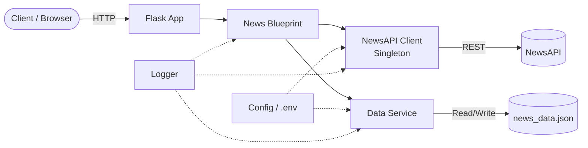

# 📰 NewsAPI Aggregation Backend

A production-ready Python Flask backend service that aggregates news data from [NewsAPI](https://newsapi.org/), with clean modular architecture, robust error handling, rate-limit tracking, and local JSON persistence.

## 🏗️ Architecture



## ✅ Prerequisites

- **Python 3.10+**
- A free API key from [newsapi.org/register](https://newsapi.org/register)

## 🚀 Setup & Installation

### 1. Clone the repository

```bash
git clone https://github.com/<your-username>/AI-Enigma.git
cd AI-Enigma
```

### 2. Create a virtual environment

```bash
python -m venv venv

# Windows
venv\Scripts\activate

# macOS / Linux
source venv/bin/activate
```

### 3. Install dependencies

```bash
pip install -r requirements.txt
```

### 4. Configure environment

```bash
cp .env.example .env
```

Edit `.env` and add your NewsAPI key:

```
NEWS_API_KEY=your_api_key_here
```

### 5. Run the server

```bash
python app.py
```

The server starts at **http://localhost:5000**.

## 📡 API Endpoints

| Method | Endpoint | Description |
|--------|----------|-------------|
| `GET` | `/` | Service info & available endpoints |
| `GET` | `/api/news/top-headlines` | Fetch top headlines |
| `GET` | `/api/news/category/<category>` | Headlines by category |
| `GET` | `/api/news/search?q=<query>` | Search all articles |
| `GET` | `/api/news/saved` | Retrieve saved articles |
| `GET` | `/api/news/status` | API quota & health check |

### Query Parameters

| Parameter | Endpoints | Description | Default |
|-----------|-----------|-------------|---------|
| `country` | top-headlines, category | 2-letter ISO country code | `us` |
| `category` | top-headlines | business, entertainment, general, health, science, sports, technology | — |
| `q` | top-headlines, search | Search keywords | — |
| `sources` | top-headlines, search | Comma-separated source IDs | — |
| `sort_by` | search | `relevancy`, `popularity`, `publishedAt` | — |
| `page` | all fetch endpoints | Page number | `1` |
| `page_size` | all fetch endpoints | Results per page (max 100) | `20` |

### Example Requests

```bash
# Top headlines (US)
curl http://localhost:5000/api/news/top-headlines

# Technology news
curl http://localhost:5000/api/news/category/technology

# Search for "artificial intelligence"
curl "http://localhost:5000/api/news/search?q=artificial+intelligence&sort_by=publishedAt"

# View saved articles
curl http://localhost:5000/api/news/saved
```

## 📁 Project Structure

```
AI Enigma/
├── app.py                  # Flask entry point (app factory)
├── .env                    # API key (git-ignored)
├── .env.example            # Environment template
├── .gitignore
├── requirements.txt        # Pinned dependencies
├── README.md
├── news_data.json          # Auto-generated output (git-ignored)
├── services/
│   ├── __init__.py
│   ├── news_client.py      # Singleton NewsAPI client
│   └── data_service.py     # Transform & persist articles
├── routes/
│   ├── __init__.py
│   └── news_routes.py      # Flask blueprint (5 endpoints)
└── utils/
    ├── __init__.py
    ├── config.py            # Environment & config loader
    └── logger.py            # Centralised logging
```

## 🔑 GitHub Secrets

For CI/CD workflows, add the following secret to your repository:

1. Go to **Settings → Secrets and variables → Actions**
2. Click **New repository secret**
3. Name: `NEWS_API_KEY`
4. Value: your NewsAPI key

## ⚙️ Design Patterns & Features

- **Singleton Pattern** — `NewsAPIClient` ensures a single shared instance with thread-safe initialisation
- **Rate-Limit Tracking** — In-memory daily counter resets at midnight UTC; returns 429 when quota is exhausted
- **Atomic Writes** — Data persisted via temp-file-then-replace to prevent corruption
- **Deduplication** — Articles merged by URL to avoid duplicates in `news_data.json`
- **Type Hinting** — Full type annotations across the entire codebase
- **Structured Logging** — Console + file logging with consistent formatting

## 📄 License

This project is open source and available under the [MIT License](LICENSE).
